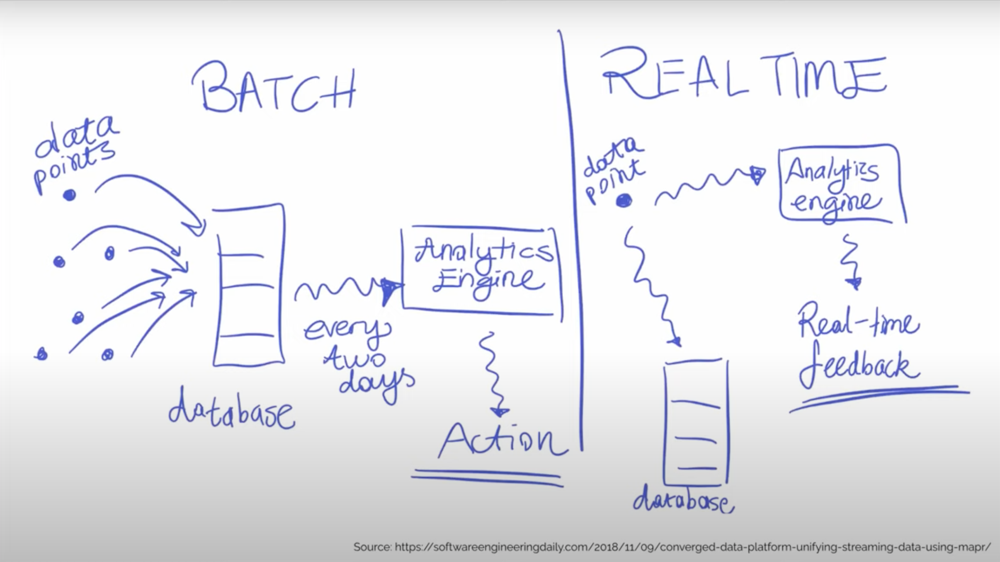
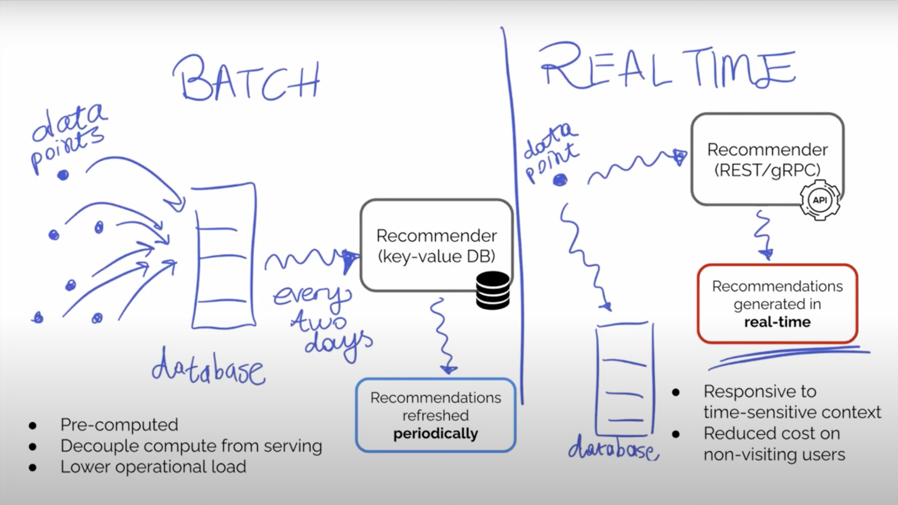

# Batch Training vs. Real-Time Training

## Batch Training

1. Data Flow
   1. Data Source -> Database -> ML Model
2. Pros
   1. Pre-computed
   2. Decouple training and serving
   3. Lower operational cost

## Real-Time Training

1. Data Flow
   1. Data Source -> Database
   2. Data Source -> ML Model
2. Pros
   1. More suitable for time-sensitive contexts
   2. No computational cost for non-visiting/non-returning users
