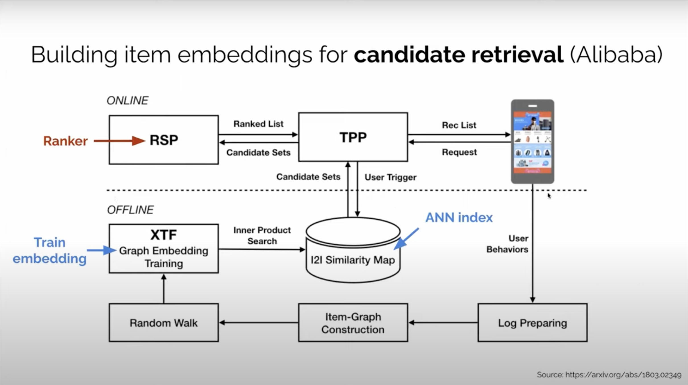
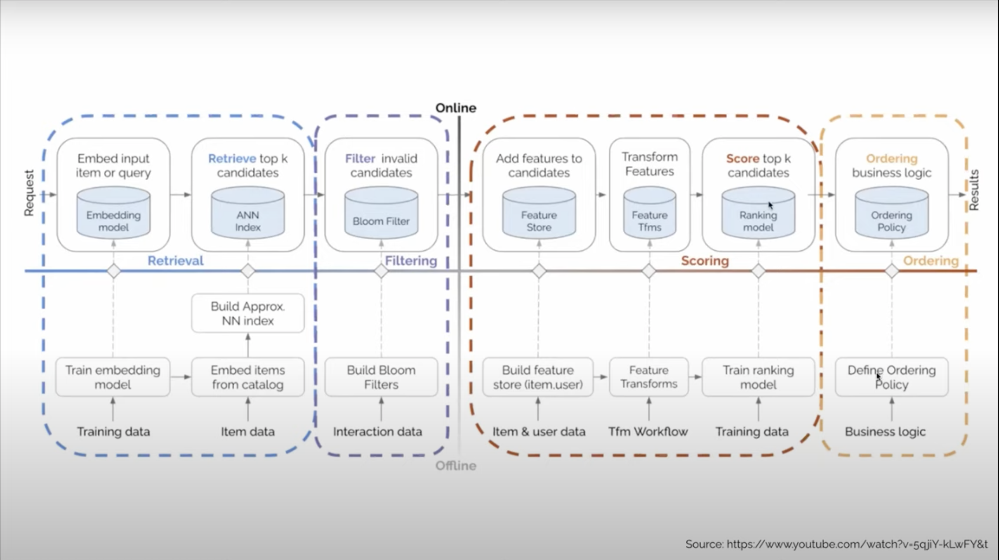

# Retrieval Ranking Systems

## Concepts

### Retrieval

1. Attributes: Fast but coarse
2. Scope: Select hundreds of items from millions of candidates
3. Algorithms: Approximate Nearest Neighbor (ANN) Search, Graph

### Ranking

1. Attributes: Slow but precise
2. Scope: Rank hundreds of items
3. Algorithms: Classification, Learning to Rank (L2R), Deep Learning

## Examples

### Alibaba Candidate Retrieval System

1. Components
   1. TPP (Taobao Personalization Platform) - responsible for retrieval
   2. RSP (Ranking Service Platform) - responsible for ranking
2. Configuration
3. Composition
   1. Offline Workflow
      1. User Behavior
      2. Log Preparation
      3. Item-Graph Construction
      4. Random Walk
      5. Graph Embedding Training
      6. MIPS (Maximum Inner Product Search)
      7. i2i Similarity Map
   2. Online Workflow
      1. Get user request
      2. Get previously bought/browsed items
      3. Get candidates set through ANN i2i similarity map
      4. Get rank list from RSP

### Alibaba Graph Networks for Ranking

### Facebook Retrieval-Ranking System

### Youtube Retrieval System

1. Input Embeddings
   1. Embedded Videos Watched
   2. Embedded Search Tokens
2. Training Network
   1. Classifier
3. Inference Network
   1. ANN Search (Approximate Nearest Neighbor)

## Nvidia Retrieval-Filtering-Scoring-Ordering Systems

### Special Features

1. Filtering
   1. Bloom Filter
2. Ordering
   1. Order by business order for better user experiences
