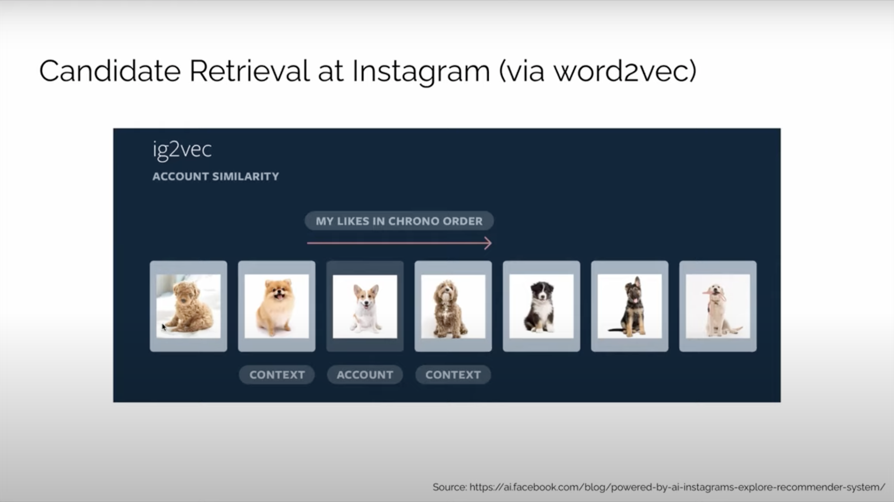

# Embedding Models

## Concepts

1. Context: Embedding models derive embeddings from related contexts.
2. Target
   1. Contrastive Learning: Embedding models learn to differentiate between positive and negative samples.
   2. CBOW: Embedding models predict the target word from the context.
   3. Skip-gram: Embedding models predict the context words from the target word.
3. Learning Preparation
   1. Direct Learning
      1. Directly use the given sequence.
   2. Indirect Learning
      1. Use the given sequence to generate graph networks.
      2. Random Walk: Randomly generate sequences from the graph networks via random walk.
      3. Use the generated sequences for learning.

## Examples

### ig2vec Item Embedding (Instagram)

