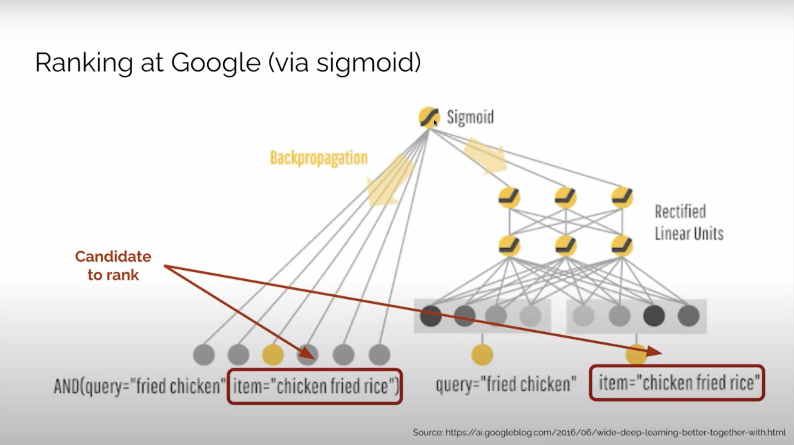
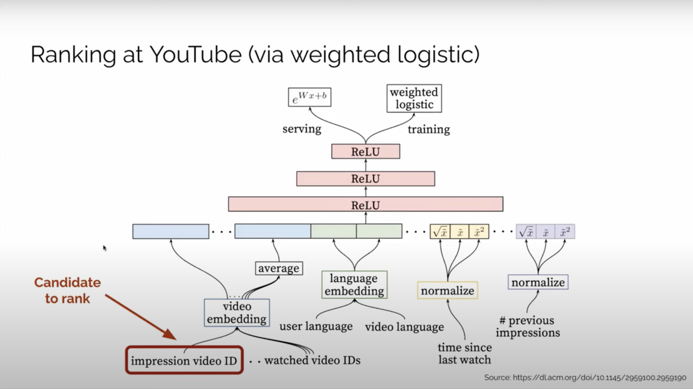
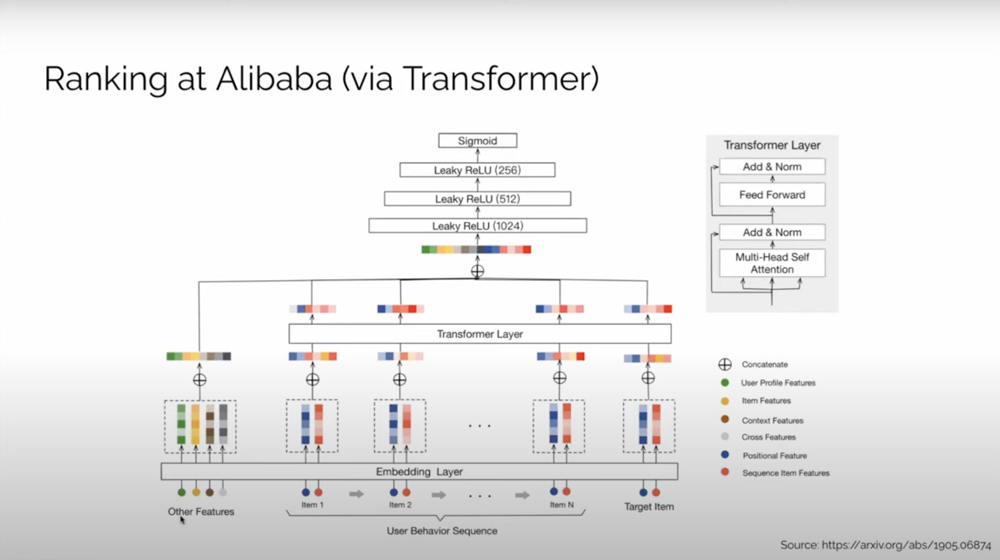

# Ranking Models

## Features

1. Different from retrieval models, ranking models take items and users as input, but the retrieval models give items as the output.
2. We need to append additional features to items retrieved from the last step.
3. Each inference only evaluates the ranking value for one item.

## Examples

