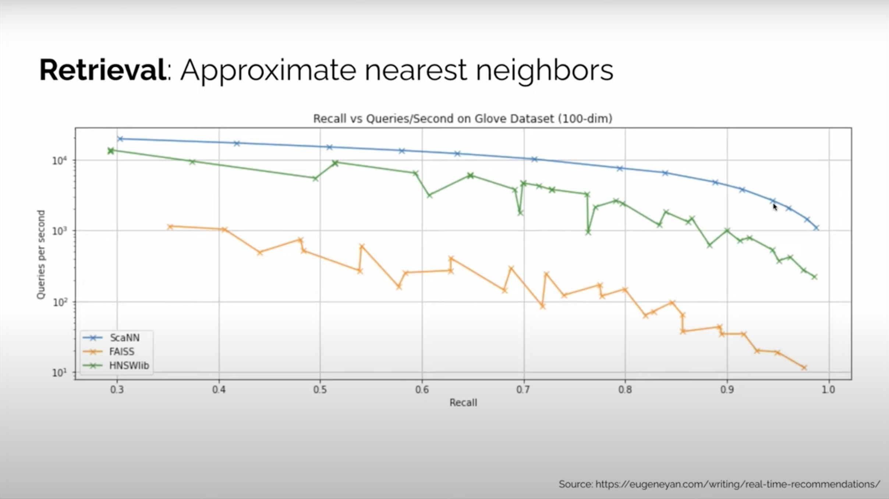

# ANN Algorithms in Retrieval Submodule

## Categories

1. ScaNN (Scalable Nearest Neighbors) by Google
2. HNSW (Hierarchical Navigable Small World) by Facebook
3. FAISS (Facebook AI Similarity Search) by Facebook

## Benchmarks

ScaNN outperforms other algorithms.

