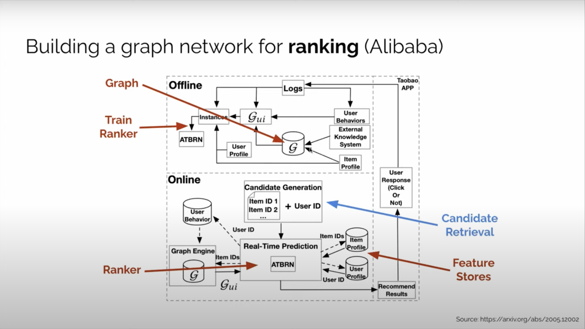
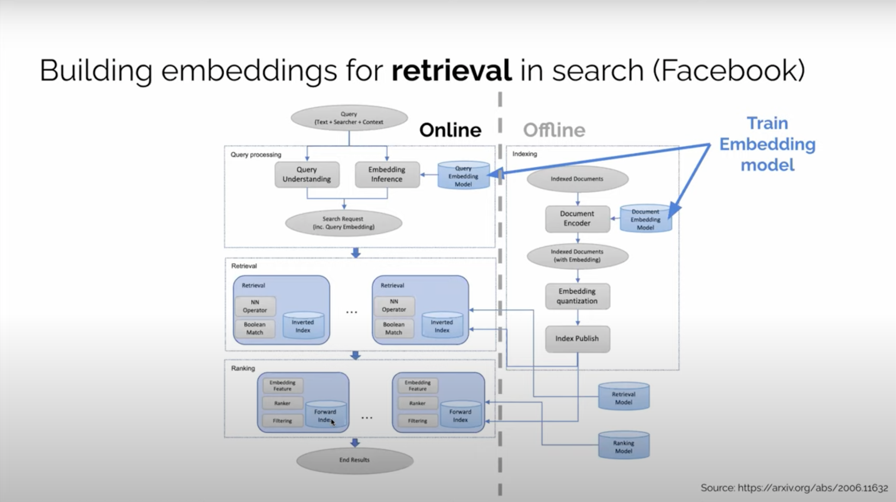

# Modules in Recommendation Systems

## Alibaba Candidate Retrieval System

1. Components
   1. TPP (Taobao Personalization Platform) - responsible for retrieval
   2. RSP (Ranking Service Platform) - responsible for ranking
2. Configuration
3. Composition
   1. Offline Workflow
      1. User Behavior
      2. Log Preparation
      3. Item-Graph Construction
      4. Random Walk
      5. Graph Embedding Training
      6. MIPS (Maximum Inner Product Search)
      7. i2i Similarity Map
   2. Online Workflow
      1. Get user request
      2. Get previously bought/browsed items
      3. Get candidates set through ANN i2i similarity map
      4. Get rank list from RSP

## Alibaba Graph Networks for Ranking

## Facebook Retrieval-Ranking System

