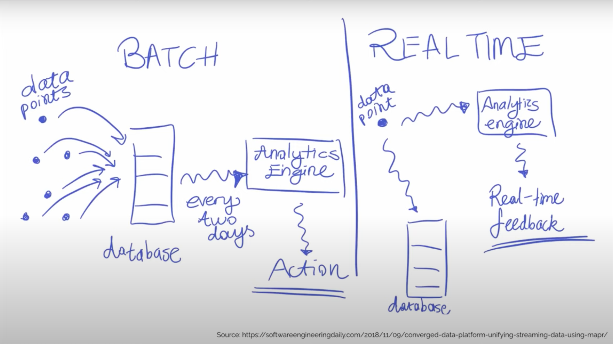

# Knowledges for Large Recommendation Systems

## Batch vs. Real-Time

1. Batch Training
   1. Data Flow
      1. Data Source -> Database -> ML Model
   2. Pros
      1. Pre-computed
      2. Decouple training and serving
      3. Lower operational cost
2. Real-Time Training
   1. Data Flow
      1. Data Source -> Database
      2. Data Source -> ML Model
   2. Pros
      1. More suitable for time-sensitive contexts
      2. No computational cost for non-visiting/non-returning users

## Real-Time Tasks

### Offline Tasks vs. Online Tasks

1. Offline Tasks
   1. Model Training
   2. Index/Graph Building
   3. Data Featurization/Loading
2. Online Tasks
   1. Use offline artifacts to serve real-time requests (Inference)
   2. Includes
      1. Candidate Retrieval
      2. Ranking

### Retrieval vs. Ranking

1. Retrieval
   1. Attributes: Fast but coarse
   2. Scope: Select hundreds of items from millions of candidates
   3. Algorithms: Approximate Nearest Neighbor (ANN) Search, Graph
   4. Examples
      1. [Alibaba Candidate Retrieval System](../modules.md)
2. Ranking
   1. Attributes: Slow but precise
   2. Scope: Rank hundreds of items
   3. Algorithms: Classification, Learning to Rank (L2R), Deep Learning
