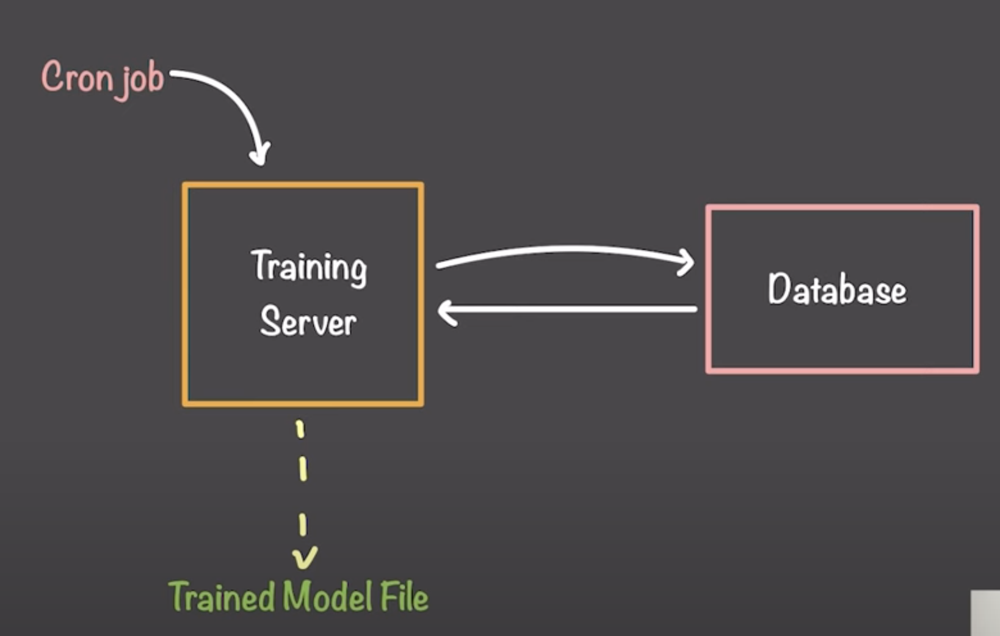
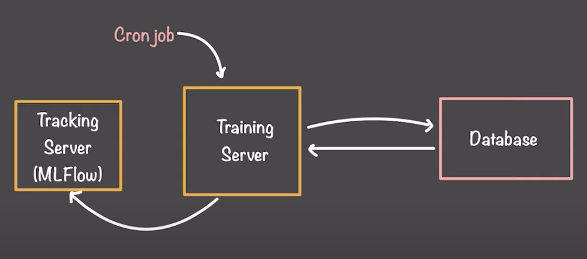
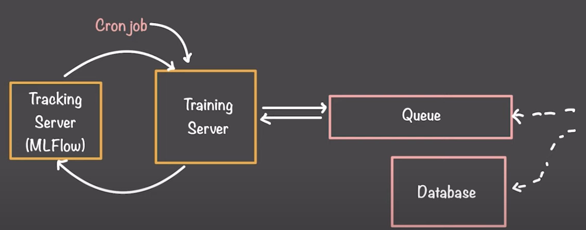
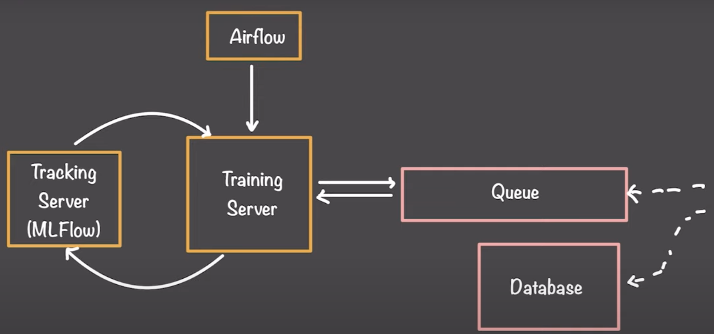
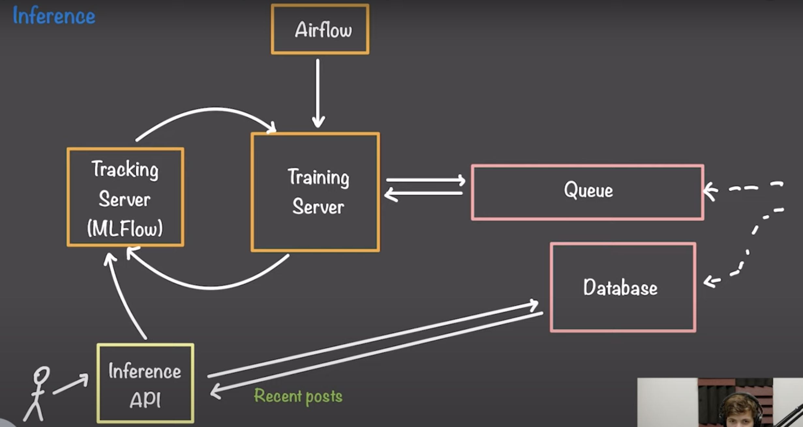
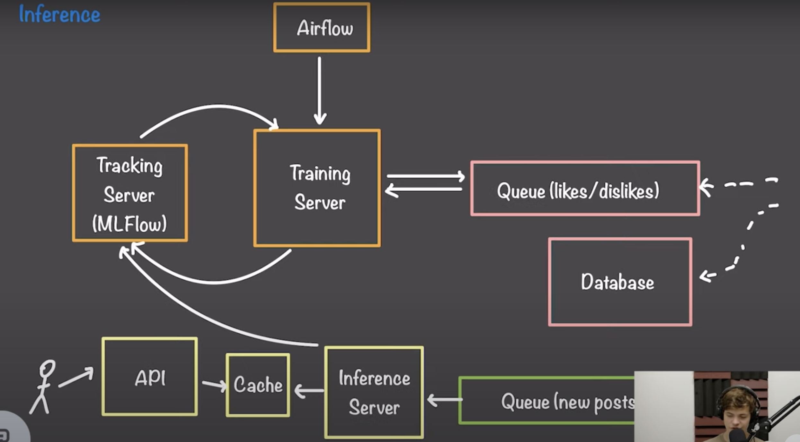

# Recommendation System Design

## Step 1

1. Problems
   1. Design a online training system for recommendation.
2. Trade-offs
3. Designs
   1. Use a cron job scheduler to periodically train the model.
   

## Step 2

1. Problems
   1. Scale up the trained model file management.
2. Trade-offs
3. Designs
   1. Use MLFlow to manage the model files and add visibility, scalability, and observability.
   

## Step 3

1. Problems
   1. Make the training system compatible with streaming data.
2. Trade-offs
3. Designs
   1. Use queue to buffer the streaming data and train the model in batch.
   

## Step 4

1. Problems
   1. Scale up the cron job scheduler.
2. Trade-offs
3. Designs
   1. Use Airflow to manage the cron job scheduler.
   

## Step 5

1. Problems
   1. Integrate the inference system.
2. Trade-offs
   1. Infer the model only when users call the API.
   
   2. Pre-infer the model and store the results in a cache.
   
3. Designs
   1. Cache the inference results in Redis.
